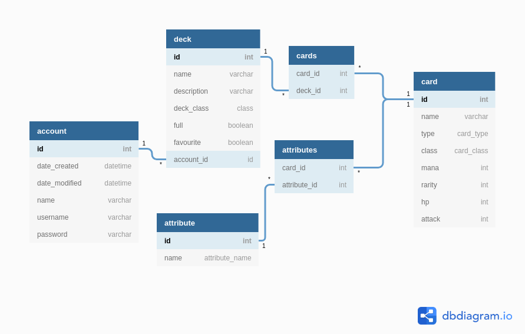

## Database schema




### Create Tabe Statements

```CREATE TABLE attribute (
	id INTEGER NOT NULL, 
	name VARCHAR(144) NOT NULL, 
	PRIMARY KEY (id)
);
CREATE TABLE account (
	id INTEGER NOT NULL, 
	date_created DATETIME, 
	date_modified DATETIME, 
	name VARCHAR(144) NOT NULL, 
	username VARCHAR(144) NOT NULL, 
	password VARCHAR(144) NOT NULL, 
	PRIMARY KEY (id)
);
CREATE TABLE card (
	id INTEGER NOT NULL, 
	name VARCHAR(144) NOT NULL, 
	tribe VARCHAR(144), 
	card_class VARCHAR(144) NOT NULL, 
	attack INTEGER, 
	defence INTEGER, 
	mana INTEGER NOT NULL, 
	rarity VARCHAR(144) NOT NULL, 
	favourite BOOLEAN NOT NULL, 
	text VARCHAR(255), 
	account_id INTEGER NOT NULL, 
	PRIMARY KEY (id), 
	CHECK (favourite IN (0, 1)), 
	FOREIGN KEY(account_id) REFERENCES account (id)
);
CREATE TABLE deck (
	id INTEGER NOT NULL, 
	name VARCHAR(144) NOT NULL, 
	"full" BOOLEAN NOT NULL, 
	favourite BOOLEAN NOT NULL, 
	description VARCHAR(1024) NOT NULL, 
	deck_class VARCHAR(144) NOT NULL, 
	account_id INTEGER NOT NULL, 
	PRIMARY KEY (id), 
	CHECK ("full" IN (0, 1)), 
	CHECK (favourite IN (0, 1)), 
	FOREIGN KEY(account_id) REFERENCES account (id)
);
CREATE TABLE attributes (
	attribute_id INTEGER NOT NULL, 
	card_id INTEGER NOT NULL, 
	PRIMARY KEY (attribute_id, card_id), 
	FOREIGN KEY(attribute_id) REFERENCES attribute (id), 
	FOREIGN KEY(card_id) REFERENCES card (id)
);
CREATE TABLE cards (
	deck_id INTEGER NOT NULL, 
	card_id INTEGER NOT NULL, 
	PRIMARY KEY (deck_id, card_id), 
	FOREIGN KEY(deck_id) REFERENCES deck (id), 
	FOREIGN KEY(card_id) REFERENCES card (id)
);```